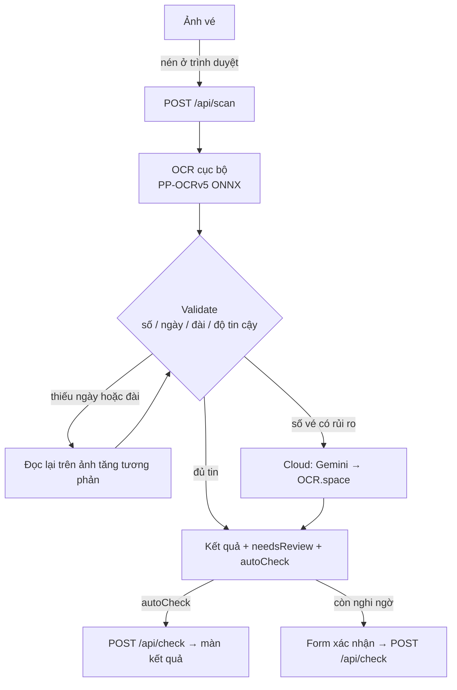

# Dò Vé Số

Web app (PWA) dò vé xổ số kiến thiết miền Nam: chụp ảnh vé, máy tự đọc số vé, đài và ngày mở thưởng rồi dò với kết quả đã cào về.

Bản đang chạy: **https://dove-so.duckdns.org**

## Tính năng

- **Dò vé bằng ảnh**: chụp bằng camera hoặc chọn ảnh có sẵn. Vé đọc chắc chắn cả số, đài và ngày thì dò luôn, còn nghi ngờ trường nào thì hỏi lại người dùng trên form (trường nghi ngờ được đánh dấu).
- **Kết quả dò**: trúng giải nào, tổng tiền. Có trạng thái riêng cho vé hết hạn lĩnh thưởng (30 ngày), vé chưa tới giờ xổ và đài chưa có kết quả.
- **Thống kê cộng đồng**: màn Dò vé hiện tổng số vé cả hệ thống đã dò, số vé trúng và tổng tiền thưởng (mỗi vé tính 1 lần).
- **Bảng kết quả từng đài**: đủ giải ĐB → G.8. Mở từ vé vừa dò thì các chữ số cuối trùng với vé được tô xanh.
- **6 số may mắn**: chọn ngẫu nhiên kiểu Vietlott Mega 6/45 và Power 6/55.
- **Dự đoán**: thống kê 2 số cuối của 18 giải trong 1 năm từng đài → số nóng, lô gan, gợi ý giải ĐB, bảng xác suất 00–99 cho mỗi ngày xổ. Xem lại ngày đã xổ để đối chiếu gợi ý với kết quả thật. Chỉ là thống kê cho vui.
- **Blog**: ai cũng đọc, viết và like/dislike được; ký tên bằng tài khoản (cần đăng nhập), ẩn danh hoặc tự đặt tên. Người đăng (đã đăng nhập) xoá được bài của mình. Chống spam bằng rate limit theo IP.
- **Giao diện**: mặc định Gold & Navy, đổi được chế độ sáng/tối, bảng màu và hình nền. Responsive, cài được như app (PWA).
- **Kết quả tự cập nhật**: backend tự cào kết quả XSMN mỗi ngày sau giờ xổ.

## Cách hoạt động



- **OCR cục bộ trước, cloud sau.** Tất cả quyết định dựa trên `TicketResultValidator`: số vé phải đúng 6 chữ số và không mơ hồ, ngày phải nằm trong khoảng hợp lý, tên đài phải khớp nguyên văn, độ tin cậy phải đạt ngưỡng.
  - Chỉ khi **số vé** có rủi ro mới gọi cloud (Gemini, lỗi thì OCR.space), vì số vé khó sửa tay nhất.
  - Nếu chỉ đài hoặc ngày chưa chắc thì đánh dấu để người dùng tự chọn lại, nhanh hơn chờ cloud.
- **`autoCheck`** chặt hơn "không trường nào cần kiểm tra". Số vé phải đến từ cloud hoặc từ OCR cục bộ đạt ngưỡng tin cậy. Nếu ngày đã quá cũ thì phải đọc khớp ở ít nhất 2 chỗ trên vé.
- **Kết quả xổ số** do `DailyResultFetchWorker` cào từ xosodaiphat.com:
  - Bắt đầu lúc 16:45 giờ VN. Hôm nay còn thiếu đài nào thì cứ 10 phút thử lại, tới 20:00 thì dừng.
  - Khi khởi động, worker cào bù những ngày còn thiếu trong 30 ngày, rồi cào bù dần kết quả 1 năm (cho màn Dự đoán).
  - SQLite chỉ là bộ đệm khoảng 1 năm (dò vé / bảng kết quả chỉ dùng 30 ngày gần nhất): mất file DB thì lần khởi động sau tự cào lại.

## Tech stack

| Phần | Công nghệ |
|---|---|
| Backend | .NET 10, ASP.NET Core Web API, EF Core + SQLite, Serilog, Scalar (OpenAPI UI) |
| OCR | RapidOcrNet (PP-OCRv5 ONNX), Tesseract (engine dự phòng / so sánh), ImageSharp; cloud: Gemini, OCR.space |
| Cào kết quả | HtmlAgilityPack |
| Frontend | React 19, TypeScript, Vite 8, Tailwind CSS 3, vite-plugin-pwa, lucide-react, react-webcam, axios |
| Deploy | Oracle Cloud VM (Ubuntu) + Caddy + systemd, domain DuckDNS; Cloudflare Tunnel cho bản chạy tạm |

## Cấu trúc thư mục

```
backend/
  LotteryChecker.Api/
    Controllers/    Scan (quét + dò), Results (bảng kết quả), Admin (công cụ dev), Ping
    Services/       OCR engines, TicketTextParser, TicketResultValidator, LotteryMatcher,
                    ResultScraper, GeminiTicketReader, CloudOcrService, ...
    Workers/        DailyResultFetchWorker — cào kết quả hằng ngày
    Data/, Models/, Migrations/
  LotteryChecker.Tests/   xUnit
frontend/
  src/
    pages/Home.tsx  luồng chụp → xác nhận → kết quả
    components/     camera, form xác nhận, kết quả, bảng đài, theme picker, ...
    api/client.ts   gọi API + nén ảnh trước khi gửi
    theme.ts, index.css   hệ thống theme (biến CSS → Tailwind)
deploy/             script + hướng dẫn deploy (xem deploy/README.md)
.claude/            tài liệu thiết kế và hướng dẫn chi tiết
```

## Chạy local

Cần: [.NET 10 SDK](https://dotnet.microsoft.com/download) và Node.js 20.19+ hoặc 22.12+.

**Backend** (cổng 5177):

```bash
cd backend/LotteryChecker.Api
dotnet run
```

- Lần chạy đầu tự tạo `lottery.db`, chạy migration, thêm dữ liệu mẫu (chỉ ở Development) và cào bù kết quả.
- Model PP-OCRv5 đi kèm package, không phải tải thêm.
- Xem và gọi thử API tại http://localhost:5177/scalar/v1.

**Key cloud OCR** (không bắt buộc). Không có key thì chỉ dùng OCR cục bộ.

```bash
dotnet user-secrets set "Gemini:Enabled" "true"
dotnet user-secrets set "Gemini:ApiKey" "<key từ https://aistudio.google.com/apikey>"
dotnet user-secrets set "CloudOcr:ApiKey" "<key từ https://ocr.space/ocrapi>"
```

**Frontend** (cổng 5173):

```bash
cd frontend
npm install
npm run dev
```

- Vite chuyển tiếp `/api/*` sang `localhost:5177`, nên không cần cấu hình CORS hay URL API.
- Trình duyệt chỉ cho mở camera trên HTTPS hoặc `localhost`. Điện thoại vào qua `http://<IP-LAN>:5173` thì chỉ chọn ảnh được, không chụp được. Muốn thử camera trên điện thoại thì chạy `deploy/tunnel.ps1` để có link HTTPS.
- VS Code: cấu hình debug **🚀 Full Stack** chạy cả hai.

## Cấu hình

Các cấu hình chính nằm trong `backend/LotteryChecker.Api/appsettings.json`. Trên server, đặt bằng biến môi trường với dấu `__` thay cho `:` (vd `Gemini__ApiKey`) trong file `/etc/lottery-api.env`.

| Khoá | Mặc định | Ý nghĩa |
|---|---|---|
| `Ocr:LocalEnabled` | `true` | `false` = không nạp model cục bộ, cloud đọc thẳng mọi vé |
| `Ocr:Engine` | `onnx` | `onnx` (PP-OCRv5) hoặc `tesseract` |
| `Ocr:RetryPreprocess` / `RetryStrategy` | `Contrast` / `Lines` | Đọc lại để lấp ngày/đài còn thiếu |
| `Ocr:Validation:MinConfidence` | `0.80` | Ngưỡng tin cậy để khỏi gọi cloud |
| `Ocr:Validation:MaxDaysPast` / `MaxDaysAhead` | `60` / `14` | Khoảng ngày coi là hợp lý |
| `Gemini:Enabled` / `ApiKey` / `Model` | `false` / — / `gemini-3.1-flash-lite` | Gemini đọc vé |
| `CloudOcr:Enabled` / `ApiKey` | `true` / — | OCR.space (dự phòng khi Gemini lỗi) |
| `CloudOcr:OnlyForTicketNumber` | `true` | Chỉ gọi cloud khi số vé có rủi ro |
| `ConnectionStrings:Default` | `Data Source=lottery.db` | File SQLite |

Engine Tesseract (và endpoint `/api/admin/ocr-debug`) cần thư mục `tessdata`. Thư mục này không có trong repo, phải tải về:

```powershell
cd backend/LotteryChecker.Api; mkdir tessdata
Invoke-WebRequest https://github.com/tesseract-ocr/tessdata/raw/main/vie.traineddata -OutFile tessdata/vie.traineddata
Invoke-WebRequest https://github.com/tesseract-ocr/tessdata/raw/main/eng.traineddata -OutFile tessdata/eng.traineddata
```

## API

| Endpoint | Việc |
|---|---|
| `GET /api/scan/options` | Cỡ và chất lượng ảnh frontend nên nén trước khi gửi |
| `POST /api/scan` | Gửi ảnh (multipart, field `image`), nhận số vé / ngày / đài + `needsReview`, `autoCheck`, thời gian từng chặng |
| `POST /api/check` | `{ ticketNumber, drawDate, province }` → trạng thái vé và các giải trúng |
| `GET /api/results/available` | Danh sách (ngày → các đài) đang có kết quả |
| `GET /api/results/{date}/{province}` | Bảng giải đầy đủ của 1 đài trong 1 ngày |
| `GET /health` | Kiểm tra sống |

Chỉ có ở môi trường Development:

| Endpoint | Việc |
|---|---|
| `POST /api/admin/fetch` | Cào lại 30 ngày |
| `GET /api/admin/data` | Liệt kê dữ liệu trong DB |
| `POST /api/admin/ocr-benchmark` | Đo độ chính xác và tốc độ OCR trên ảnh vé thật |
| `POST /api/admin/ocr-tuning`, `POST /api/admin/ocr-debug` | Công cụ chỉnh OCR |

Ví dụ gọi API có sẵn trong `backend/LotteryChecker.Api/api-tests.http`.

## Kiểm thử

```bash
cd backend && dotnet test              # unit test: parser, validator, dò giải, lịch cào, Gemini, ...
cd frontend && npm run lint && npm run build
```

Đo OCR trên ảnh vé thật. Ảnh không có trong repo; tên file nên chứa đáp án để benchmark tự chấm:

```bash
curl -F "images=@TPHCM_388003.jfif" -F "images=@..." "http://localhost:5177/api/admin/ocr-benchmark?grid=false"
```

Chỉ số quan trọng nhất là `falsePass`: số vé qua validate (tức sẽ không hỏi lại) mà đọc sai. Chỉ số này phải bằng 0.

## Deploy

Deploy lên VM bằng một lệnh, chạy từ máy Windows:

```powershell
.\deploy\publish.ps1 -Server ubuntu@<IP> -Key <private-key>                  # backend + frontend
.\deploy\publish.ps1 -Server ubuntu@<IP> -Key <private-key> -FrontendOnly    # chỉ frontend
```

Tài liệu liên quan:
- Cài server lần đầu, chạy tạm qua Cloudflare Tunnel: [deploy/README.md](deploy/README.md).
- Tạo VM Oracle Always Free: [deploy/ORACLE-VM.md](deploy/ORACLE-VM.md).
- Đưa frontend lên Vercel: [deploy/VERCEL.md](deploy/VERCEL.md).
- Giải thích chi tiết: [.claude/deploy-guide.md](.claude/deploy-guide.md).

## Giới hạn

- Kết quả hiện chỉ cào **XSKT miền Nam**. Vé miền Trung đọc được nhưng chưa có kết quả để dò; miền Bắc có cơ cấu giải khác nên chưa hỗ trợ.
- Số vé, đài và ngày do máy đọc, có thể sai. Hãy đối chiếu với kết quả chính thức trước khi huỷ vé.
